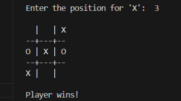
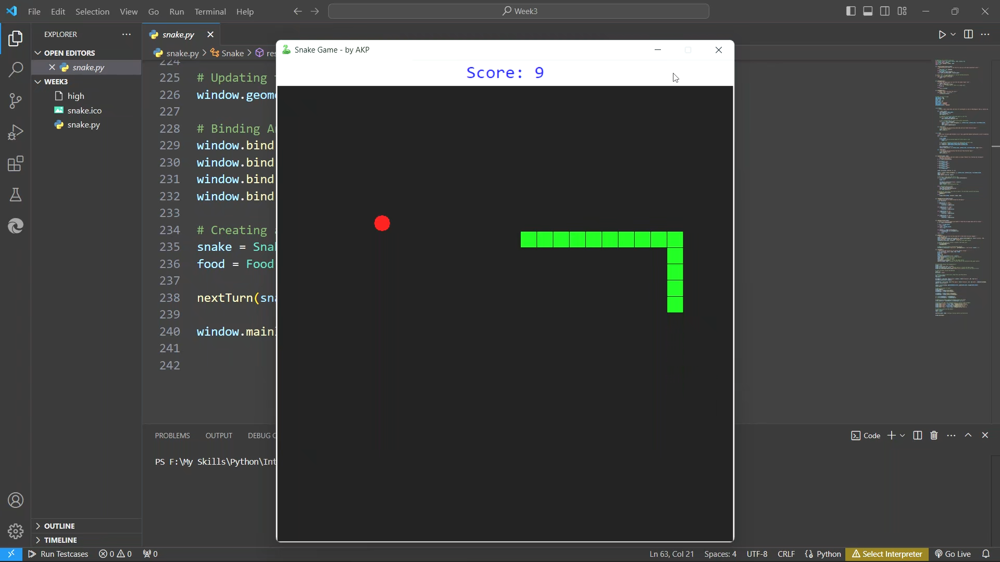
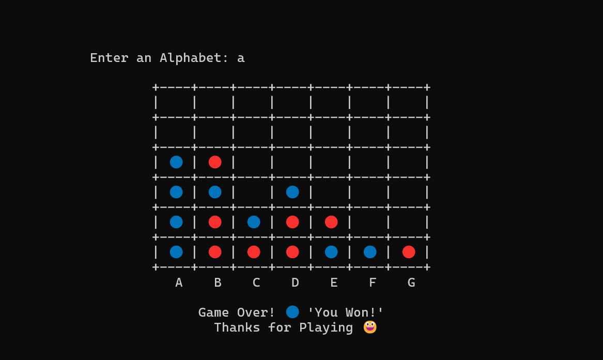

# InternPe
Hey there! This is Aashish Kumar Prasad. Here I uploaded all my Python Programming Tasks while doing internship in InternPe. Check out my work.

## Task 1: Clock                               ## Task 2: Tic Tac Toe
 

## Task 3: Snake Game

## Task 4: Connect Four

### Application download link
<a href="https://github.com/AashishKrPd/InternPe/releases/tag/v1.0.0">Download!</a>

